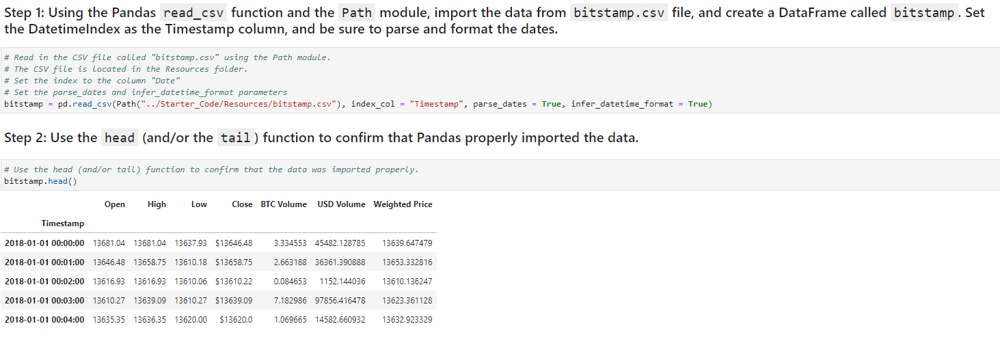
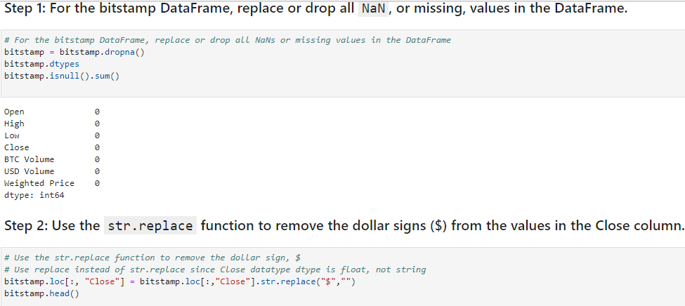
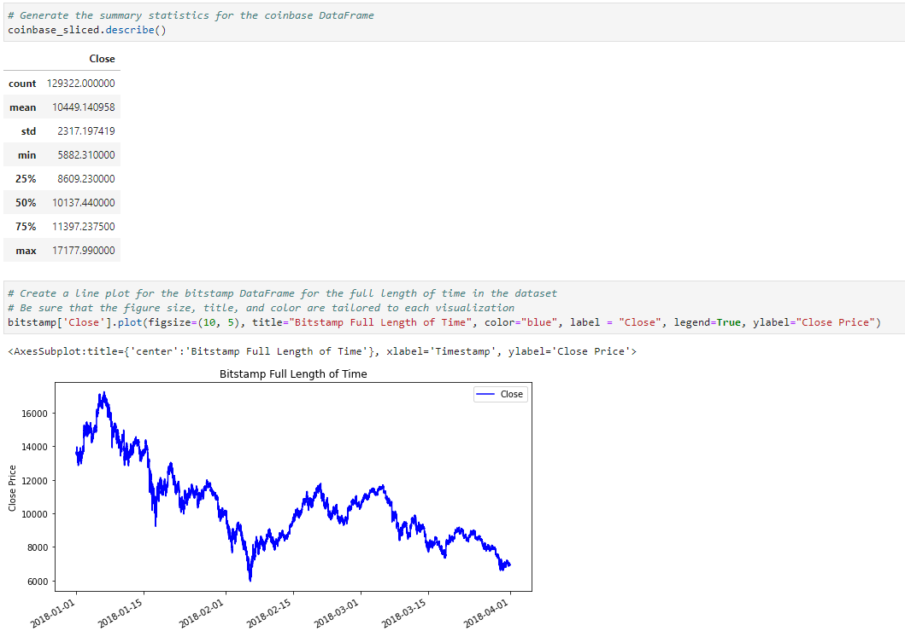
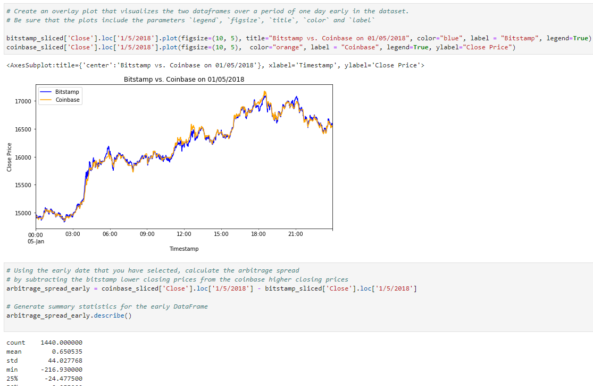
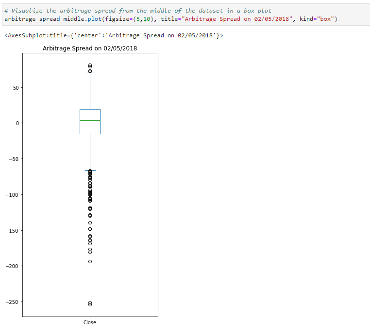
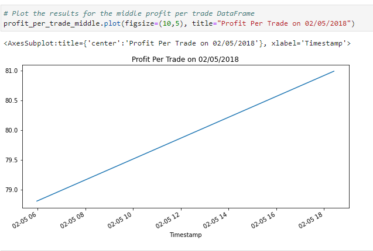

# Crypto_Arbitrage
This app finds arbitrage opportunities through historical trade data for Bitcoin on two exchanges: Bitstamp and Coinbase.

The task is to apply the three phases of financial analysis to determine if any arbitrage opportunities exist for Bitcoin.

This aspect will consist of 3 phases.

1. Collect the data.

2. Prepare the data.

3. Analyze the data. 

With minor changes, this app can be used for any two exchanges with any cryptocurrency, not necessary Bitcoin. 

---

## Technologies

This project leverages Anaconda and JupyterLab with Python 3.9:

* [Anaconda](https://www.anaconda.com/products/individual) 

Need to import the following libraries and dependencies:

```
import pandas as pd
from pathlib import Path
%matplotlib inline
```

---

## Installation Guide

Before running the application first install the following dependencies.

1. Install [Anaconda](https://www.anaconda.com/products/individual) from link 
2. Open up GitBash(Windows) or Terminal(Mac)
3. Type ```conda update conda``` to update Conda
4. Type ```conda update anaconda``` to update Anaconda
5. Type ```conda create -n dev python=3.9 anaconda```
6. Type ```conda activate dev``` to activate conda
7. Install a dev environment kernel by typing ```python -m ipykernel install --user --name dev```
8. Install a node environment by typing ```conda install -c conda-forge nodejs```
9. Launch JupyterLab by typing ```jupyter lab```


---

## Usage

You will need to clone the repo so that you can run the application:

```
 git clone https://github.com/locthai2002/Crypto_Arbitrage.git
```

Here are some screenshots from running the application:

### Collect the Data



### Prepare the Data



### Analyze the Data



### Visualize the Data



### Arbitrage Spread On a Single Day



### Profit Per Trade On A Day



---

## Contributors

Loc Thai -- www.linkedin.com/in/loc-thai-69b8a2141
Phone: 415.400.9998

---

## License

MIT
